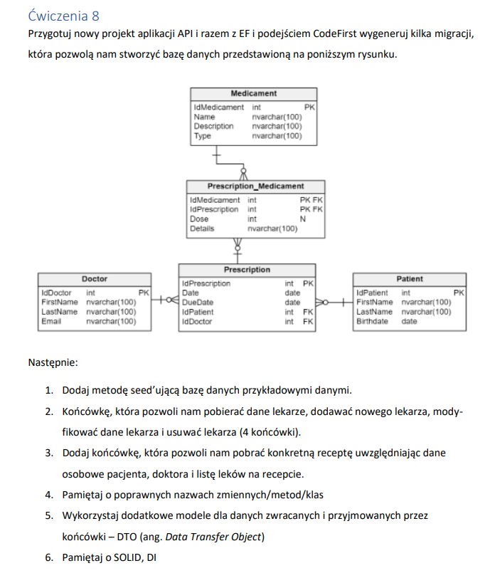

Zadanie 8



1. Zainstalować biblioteki: 
* Microsoft.EntityFrameworkCore
* Microsoft.EntityFrameworkCore.SqlServer
* Microsoft.EntityFrameworkCore.Tools

2. Dodać ConnectionString do `appsettings.json`
```
 "ConnectionStrings": {
    "DefaultConnection": "Data Source=db-mssql16.pjwstk.edu.pl;Initial Catalog=s22086;Integrated Security=True;TrustServerCertificate=True"
  }
```

3. Konfiguracja bazy danych `Program.cs`
```
   builder.Services.AddDbContext<DatabaseContext>(options =>
   options.UseSqlServer(builder.Configuration.GetConnectionString("DefaultConnection")));
```

4. Stopniowo przygotowywać bazę danych wraz z odpowiednimi endpointami - przyrostowo endpointy i przyrostowo baza danych

4.1. Stworzyć kontrolery z odpowiednimi metodami.
    
4.2. Stworzyć odpowiednie klasy DTO - potrzebne do pobierania lub zwracania danych przez kontrolery.

4.3. Pamiętać o walidacji obiektów WEJŚCIOWYCH.

4.4. Pamiętać o poprawnych dekoratorach metod wraz z odpowiednimi parametrami - przykładowo dla metody PUT pamiętać o id: [HttpPut("id")] i parametr id w metodzie, itd.

4.5. Metody mogą być od razu async i zwracać Task<...>

4.6. Po zrobieniu zaślepek można zrobić commit, przechodzimy do robienia bazy danych.

5. Jako że mamy przygotować bazę danych za pomocą kilku migracji, to podejdźmy do zadania przyrostowo.

5.1. Przyrostowo to jak? Nie musimy za jednym zamachem robić całej bazy danych, można podzielić to na 2-3 etapy.

5.2. Należy zacząć od najbardziej bazowych tabel, które nie mają połączeń z innymi tabelami.

5.3. W kolejnej iteracji migracji będzie można dodać jedno połączenie, potem kolejne - za pomocą tabel złączeniowych.

6. Przygotowanie procesu migracji:

6.1. W 1 kroku definiuję sobie tabele encji, np. Doctor, w wykładzie jest przykład kodu. Należy pamiętać o odpowiednich dekoratorach 

`[Key]` - na polu z kluczem głównym, 

`[Required]` na polach obowiązkowych, czy 

`[MaxLength(...)]` na stringach, by określić ich długość. Warto też pamiętać o dopisku = null!; przy deklaracji pól w entity, zapewnia to kompilator, że pole nie może być nullem. Takie dodatkowe zabezpieczenie.

6.2. Po utworzeniu klas encji/modeli w klasie kontekstu (czyli dziedziczącej po `DbContext`) należy utworzyć pola analogicznie do tego, co wstawię:

WAŻNE: jeżeli dodamy to przed wykonaniem migracji, to nazwa tej kolekcji będzie nazwą tabeli, w przypadku niedodania tej linijki nazwa tabelki będzie wzięta z nazwy klasy. Miałem z tym problem w rozwiązaniu u siebie, bo nazwy niektórych tablic mają u mnie liczbę mnogą w nazwie, a inne pojedynczą - w zależności od tego w jakiej kolejności to zrobiłem.

```public virtual DbSet<Doctor> Doctors { get; set; }```

6.3. Po utworzeniu klasy reprezentującej tabelę oraz tego pola w kontekście można utworzyć migrację.

6.4. W tym celu należy zainstalować zależności dotnetowe w konsoli. Jeżeli na komputerze nie było wcześniej zainstalowane, to należy uruchomić takie polecenie:

`dotnet tool install --global dotnet-ef --version 7.0.15`

Warto zauważyć, że wskazana wersja musi odpowiadać wersji entity framework dodanej do projektu - czyli stosujemy tę samą wersję, by nie było kłopotów z działaniem.
Jeżeli było to wcześniej zainstalowane, to podczas odpalenia po prostu wyskoczy błąd i można przejść dalej.

6.5. Odpalenie migracji polega na odpaleniu w konsoli odpowiedniej komendy. WAŻNE: musi być to odpalone w odpowiednim folderze, przykładowo:

`/c/PJATK/APBD/apbd-8-sXXXXX/apbd-8-sXXXXX`

Czyli nie ścieżka główna, tylko ścieżka solutiona.

W podanej ścieżce odpalamy komendę:

`dotnet ef migrations add NazwaMigracji`

NazwaMigracji - wpisujemy po angielsku w 2-3 słowach informację, co robi dana migracja.

Uwaga: jeżeli encje mają pole typu DateOnly, to nie zadziała, lepiej je zamienić na `DateTime`.

Jeżeli migracja ma błędy i chcemy ją cofnąć, to odpalamy:

dotnet ef migrations remove`

Dodatkowe informacje można uzyskać tutaj:

`dotnet ef migrations --help`

6.6 Utworzony zostanie folder `Migrations`

6.7. Jeżeli chcemy wypchnąć migrację do bazy danych odpalamy komendę:

`dotnet ef database update`

Spodowuje to odpalenie SQL na bazie danych. Pamiętać o wcześniejszym skonfigurowaniu połączenia, VPN itd.

7. Kod migracji należy dodać do commita ręcznie, bo wygenerowane klasy nie są dodawane automatycznie do gita. Dodać je ręcznie.

8. Kolejne migracje polegają na dodaniu kodu w C# i następnie uruchamianiu komendy do utworzenia migracji, a następnie komendy do uruchomienia migracji na bazie danych.

9. W celu podejrzenia jaki kod SQL zostanie wygenerowany na bazie danych należy odpalić komendę

`dotnet ef migrations script`

10. Relacje 1 do wielu:

Dla przykładu mamy klasy Status, Student. Klasa Status posiada wiele odniesień do klasy Student, tj. wiele studentów może posiadać ten sam status.
W klasie, która stoi po stronie relacji "jeden", czyli Status dodajemy property:

`public virtual ICollection<Student> Students { get; set; }`

W klasie po stronie wiele, czyli Student, dodajemy:

`public int IdStatus { get; set; }`

`[ForeignKey(nameof(IdStatus)]`

`public virtual Status Status { get; set; }`

Pamiętać, że po skończeniu pracy na tych klasach trzeba utworzyć migrację i ją uruchomić, aby zmiany wpłynęły do bazy danych.

11. Mapując relację wiele do wielu za pomocą tabeli pomocniczej z dodatkowymi parametrami należy dodać dekorator do klasy definiującej taką tabelę połączeń, inaczej funkcja tworząca migrację wyrzuci błąd.
    Robimy to tak:

`[PrimaryKey(nameOf(...), ...)]`

W miejsce pierwszych ... wstawić referencję do jednego pola, w miejsce drugiego ... wstawić np. nameof(InnePole)

W taki sposób możemy utworzyć klucz główny składający się z kilku kolumn.